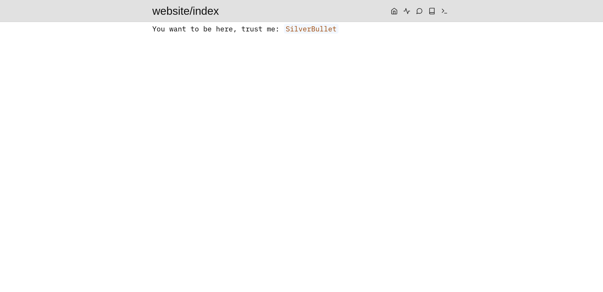
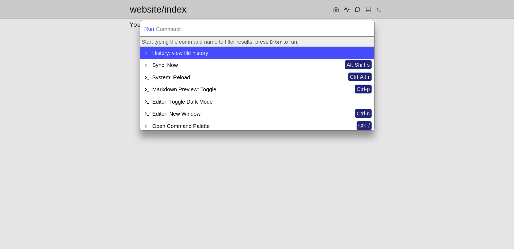
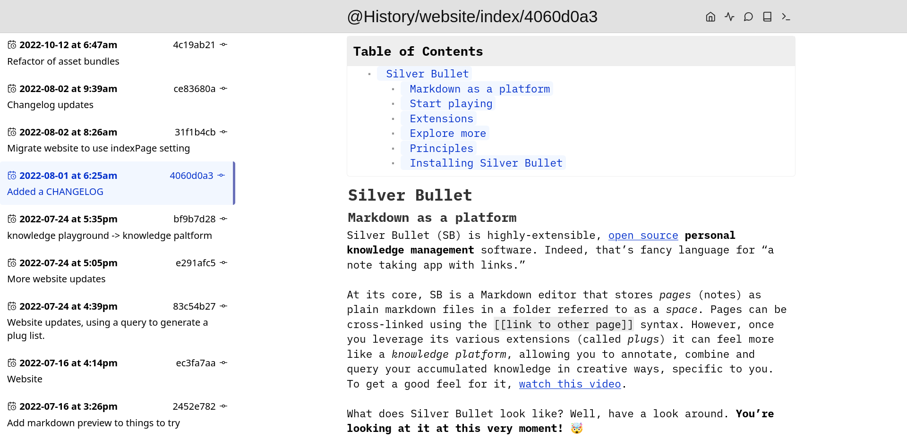
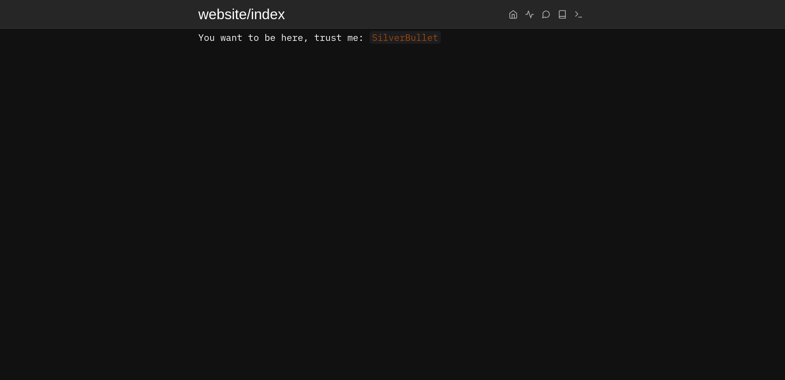
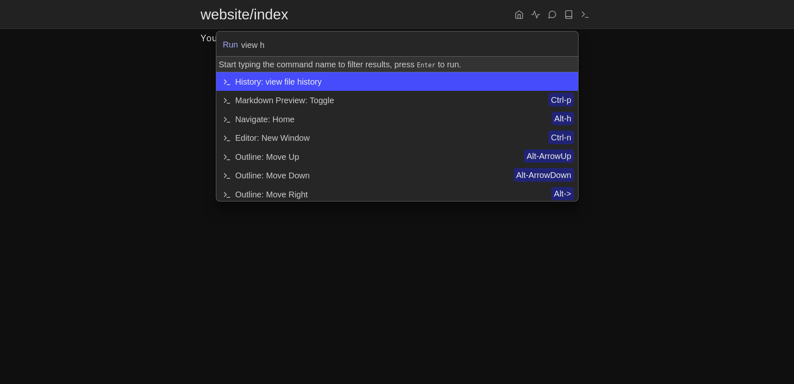
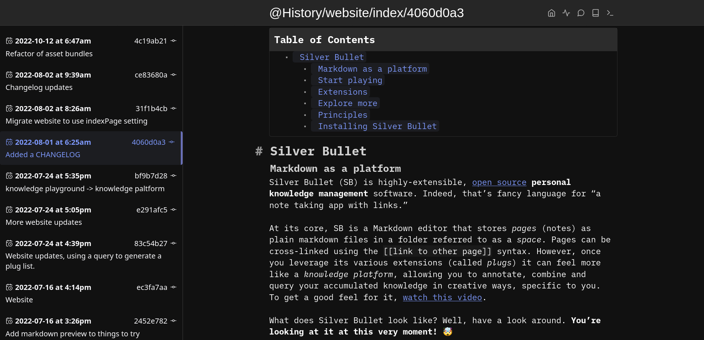

# History plugin for SilverBullet
A History plugin for [SilverBullet](https://silverbullet.md/). It provides a
version history for pages. This plugin works by getting data from `git` repo,
so if your space doesn't use `git` the plugin won't work for you.

I'm using this personally but it's pretty new so there may be bugs.

The plugin should be safe to use since I purposely didn't add any action or
code that could change the pages, you may find problems here and there but
hopefully your data will be ok.

## Screenshots








## Installation
The url for the plug is:

```
github:ivanalejandro0/silverbullet-history-git/dist/history.plug.js
```

Check out the SilverBullet docs on how to install it. Note that it changes on v2.

## Add action button

Tested on SilverBullet v2.

You can add an action button to show a page history like so:

```lua
{
  icon = "list",
  description = "History toggle",
  command = "History: toggle open/close",
}
```

Here's an example on how my CONFIG file looks like:

```lua
config.set {
  actionButtons = {
    {
      icon = "home",
      command = "Navigate: Home",
      description = "Go to the index page"
    },
    {
      icon = "list",
      description = "History toggle",
      command = "History: toggle open/close",
    },
    {
      icon = "book",
      command = "Navigate: Page Picker",
      description = "Open page"
    },
    {
      icon = "terminal",
      command = "Open Command Palette",
      description = "Run command"
    }
  },

  plugs = {
    -- your plugs here
  }
}
```

# Caveats
* this will only work if your space is in a git repo and only with the files you have versioned.
* the history won't work if you're offline, I haven't tested nor investigated much that use case.
* I haven't yet tested how this behaves with page renames. I don't think it'll show a good history on that use case.
* The history shows a linear history, but git history can be like a tree, this UI is pretty simple and if you do a lot with git you may not get the best picture of the history.
* Commits can have different authors but I'm not showing that information. I imagine most people edit their notes by themselves so showing the author information would be redundant.

## Build
To build this plug, make sure you have [SilverBullet installed with
Deno](https://silverbullet.md/Install/Deno).

Above link broken on v2, snippet:

```
deno install --force --name silverbullet --allow-all https://get.silverbullet.md --global
```

Then, build the plug with:

```shell
deno task build
```

Then, copy the resulting `.plug.js` file into your space's `_plug` folder.

SilverBullet will automatically sync and load the new version of the plug, just
watch the logs (browser and server) to see when this happens.

## Acknowledgements
Since there's not a lot of documentation on how to build plugs yet, I took
inspiration by the work of other people that also build plugs, huge thanks to
them.

* [Pomodoro](https://github.com/mirdaki/silverbullet-pomodoro)
* [Grep](https://github.com/Maarrk/silverbullet-grep)
* [Git](https://github.com/silverbulletmd/silverbullet-git)
* [Treeview](https://github.com/joekrill/silverbullet-treeview)
* [SilverBullet built in plugins](https://github.com/silverbulletmd/silverbullet/tree/main/plugs)
